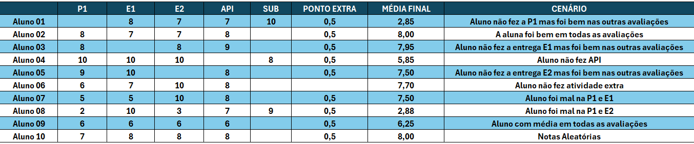
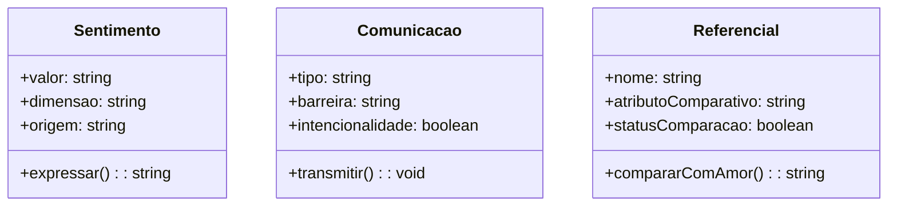
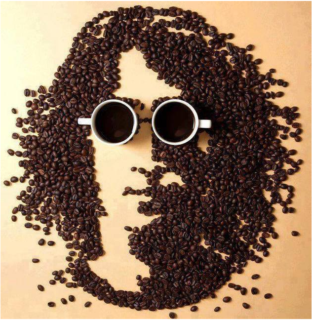
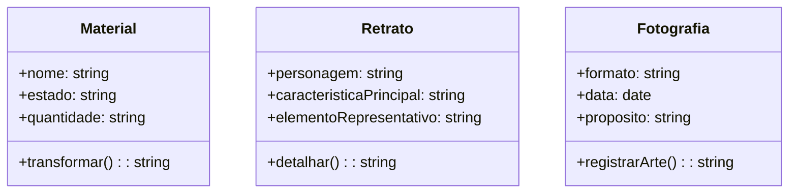
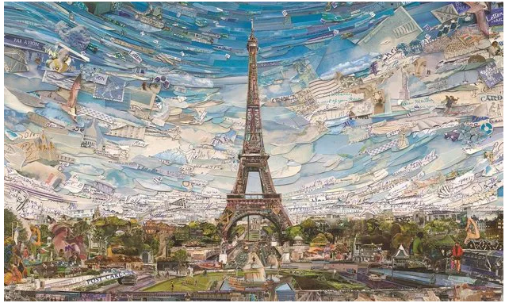
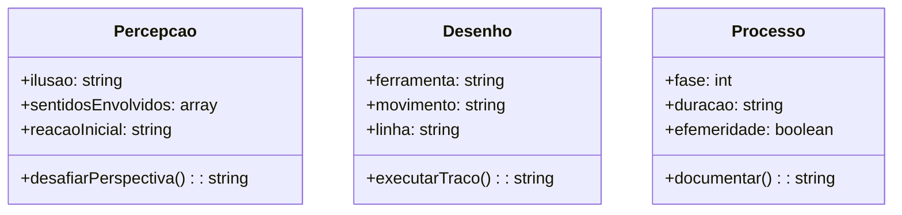
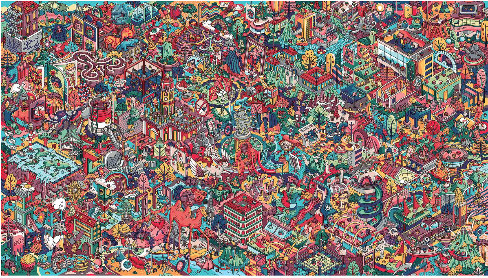
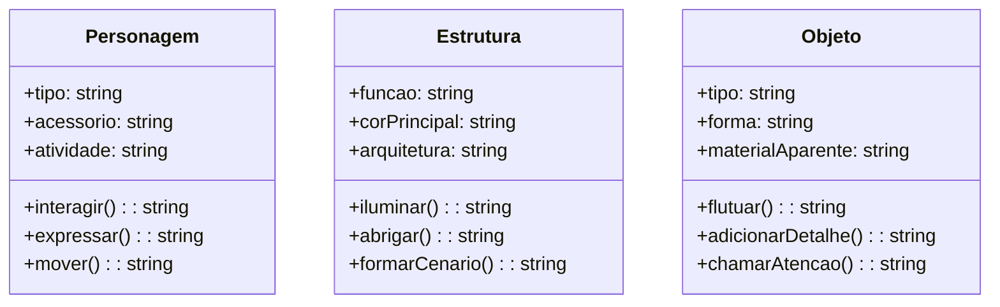
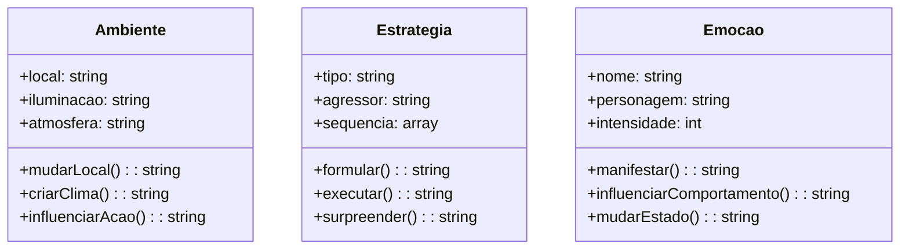

# Projeto de Linguagem de Programação I - Professora: Adriana da Silva Jacinto

E1: Classes, métodos, atributos e objetos - parte 1

## 🧪 Teste de Mesa

O teste de mesa com 10 cenários (entradas e resultados da média) está disponível no arquivo: 
<a href="https://docs.google.com/spreadsheets/d/1piFx1nxSmmgiJVqBju87PeYBEU4hi_0Q/edit?usp=sharing&ouid=113936239877542876925&rtpof=true&sd=true" target="_blank">♦ Teste de mesa</a>

  

## 🎵 Música - Como é grande o meu amor por você (Roberto Carlos)

## 📐 UML

---

## Classe 1: Sentimento

 - Atributos:

♦ valor (string): A característica principal do sentimento, como "amor" ou "paixão".

♦ dimensão (string): Descreve a escala do sentimento, por exemplo, "grande" ou "imensurável".

♦ origem (string): De onde o sentimento parte ("coração", "alma").

Método:

♦ expressar(): Tenta verbalizar o sentimento, ressaltando a dificuldade de traduzi-lo em palavras.

---

## Classe 2: Comunicação

 - Atributos:

♦ tipo (string): O meio utilizado para a comunicação, como "palavras", "olhar" ou "gestos".

♦ barreira (string): O obstáculo para a transmissão da mensagem, como a "limitação das palavras".

♦ intencionalidade (boolean): Indica se a comunicação é consciente e intencional.

Método:

♦ transmitir(): Executa a ação de enviar a mensagem, demonstrando a ineficácia ou o sucesso dessa tentativa.

---

## Classe 3: Referencial

Atributos:

♦ nome (string): O nome do elemento de comparação, como "céu", "mar" ou "estrelas".

♦ atributoComparativo (string): A característica usada para a comparação, como "tamanho" ou "beleza".

♦ statusComparação (boolean): Retorna true se o objeto for superado pelo amor e false se for igual ou superior.

Método:

♦ compararComAmor(): Avalia se o elemento é "maior" ou "mais bonito" que o amor.

---

## 🖼️ Obra Vik Muniz – *John Lennon*

<a href="https://www.culturagenial.com/vik-muniz-obras/" target="_blank">♦ John Lennon</a>

  

---

## O cantor inglês, ícone do pop, membro dos Beatles, ganhou um retrato feito a partir do café. Os grãos são responsáveis por definir o seu contorno e o seu cabelo enquanto os olhos são representados por um par de xícaras cheias. Vik Muniz consegue criar uma belíssima peça com apenas quatro elementos: o fundo liso, os grãos, as xícaras e o café pronto dentro delas. Após ser criada, a instalação foi fotografada e então exibida em mostras.

## 📐 UML 

---

## Classe 1: Material

Atributos:

♦ nome (string): O tipo de material utilizado, como "grãos de café" ou "xícaras".

♦ estado (string): A forma como o material é apresentado ("moído", "em grão", "líquido").

♦ quantidade (string): A abundância do material na obra ("par de xícaras", "grande volume de grãos").

Método:

♦ transformar(): Descreve o processo de transformação do material em arte.

---

## Classe 2: Retrato

Atributos:

♦ personagem (string): A figura retratada na obra, "John Lennon".

♦ caracteristicaPrincipal (string): O traço distintivo do retrato, como o cabelo ou os olhos.

♦ elementoRepresentativo (string): O material específico que forma a característica.

Método:

♦ detalhar(): Fornece uma descrição do que compõe os detalhes do retrato.

---

## Classe 3: Fotografia

Atributos:

♦ formato (string): O tipo de fotografia ou impressão final.

♦ data (date): O ano em que a foto foi capturada.

♦ proposito (string): O objetivo da fotografia (por exemplo, "exposição", "publicação").

Método:

♦ registrarArte(): Documenta a obra para a posteridade, transformando uma instalação efêmera em uma imagem duradoura.

---

## 🖼️ Obra Vik Muniz – *Torre Eiffiel*

<a href="https://www.culturagenial.com/vik-muniz-obras/" target="_blank">♦ Torre Eiffiel</a>

  

---

## A criação, datada de 2015, faz parte da série Postcards from nowhere. A representação de Paris feita a partir do olhar de Vik Muniz ganha contornos completamente diferentes porque o trabalho é todo realizado a partir de recortes de cartões postais. Na peça foram utilizados centenas de cartões da cidade luz que, colados, compõem a célebre paisagem da capital francesa.

## 📐 UML 

---

## Classe 1: Percepção

Atributos:

♦  ilusao (string): Descreve o tipo de ilusão criada ("bidimensional vs. tridimensional").

♦  sentidosEnvolvidos (array de strings): Os sentidos que o observador usa para interagir com a obra ("visão", "olfato" do chocolate).

♦  reacaoInicial (string): A primeira reação do público ao ver o material inusitado ("surpresa", "confusão").

Método:

♦  desafiarPerspectiva(): Demonstra como a obra manipula a percepção do observador.

## Classe 2: Desenho

Atributos:

♦  ferramenta (string): O objeto usado para "desenhar" com o material ("seringa", "pincel").

♦  movimento (string): A ação do artista para aplicar o material ("escorrendo", "pingando").

♦  linha (string): O tipo de traço criado ("fina", "grossa").

Método:

♦  executarTraco(): Descreve a técnica de aplicação do material para formar o desenho.

## Classe 3: Processo

Atributos:

♦  fase (integer): A etapa atual do processo criativo (1, 2 ou 3).

♦  duracao (string): O tempo gasto para concluir a obra efêmera ("horas", "dias").

♦  efemeridade (boolean): Indica se a obra é temporária (true).

Método:

♦  documentar(): Registra o processo criativo em texto ou imagem.

---

## 🎨 Doodle

<a href="https://www.mauromartins.com/two-dots-artistic-avenues" target="_blank">♦ Doodle</a>

  

---

## Os elementos centrais e complexos da ilustração foram escolhidos para o trabalho: os Personagens, as Estruturas e os Objetos. 

## 📐 UML

---

## Classe 1: Personagem

Esta classe representa os seres que se movem e interagem dentro do universo ilustrado.

Atributos:

♦ tipo (string): O papel ou a aparência do personagem (ex: "homem", "criatura", "robô").

♦ acessório (string): Um item que o personagem carrega ou veste (ex: "chapéu", "óculos").

♦ atividade (string): A ação que ele está realizando (ex: "andando", "observando", "interagindo").

Métodos:

♦ interagir(): Descreve como o personagem se relaciona com outros elementos da cena.

♦ expressar(): Indica a expressão facial ou corporal do personagem.

♦ mover(): Descreve o tipo de movimento que o personagem está fazendo.

## Classe 2: Estrutura

Esta classe representa os edifícios e construções que servem de cenário para a ilustração.

Atributos:

♦ funcao (string): O propósito da estrutura (ex: "comercial", "residencial", "fantástica").

♦ corPrincipal (string): A cor que mais se destaca no edifício.

♦ arquitetura (string): O estilo ou tipo de construção (ex: "torre", "casa", "prédio").

Métodos:

♦ iluminar(): Descreve como a estrutura parece iluminada.

♦ abrigar(): Indica o que ou quem a estrutura pode conter.

♦ formarCenário(): Demonstra a função da estrutura em compor o ambiente.

## Classe 3: Objeto

Esta classe representa os elementos e itens que preenchem os espaços e dão vida à cena.

Atributos:

♦ tipo (string): A categoria do objeto (ex: "veículo", "planta", "item flutuante").

♦ forma (string): O formato do objeto (ex: "redondo", "alongado").

♦ materialAparente (string): O material que o objeto parece ter sido feito.

Métodos:

♦ flutuar(): Descreve como o objeto se move no ar.

♦ adicionarDetalhe(): Explica o que o objeto contribui para a complexidade visual.

♦ chamarAtenção(): Indica se o objeto se destaca na cena.

---

## 🎬 Vídeo - Provas comprometedoras | Turma da Mônica

https://www.youtube.com/watch?v=VQcu-97EsPQ&list=PLWduEF1R_tVZYNTH8ajFOEDkDT_hfIQL9&index=2

## 📐 UML

---

## Classe 1: Ambiente

Esta classe representa o cenário onde as cenas se desenrolam.

Atributos:

♦ forma (string): O formato do objeto (ex: "redondo", "alongado").
local (string): O local da cena (ex: "casa da Mônica", "rua do bairro").

♦ iluminação (string): O tipo de iluminação do ambiente ("clara", "sombria").

♦ atmosfera (string): A sensação ou o clima do local ("suspense", "calmaria").

Métodos:

♦ mudarLocal(): Descreve a transição entre diferentes cenários no vídeo.

♦ criarClima(): Demonstra como o ambiente contribui para o clima da cena.

♦ influenciarAção(): Explica como o local afeta as ações dos personagens.

##  Classe 2: Estratégia

Esta classe representa os planos e táticas usadas pelos personagens.

Atributos:

♦ tipo (string): A natureza da estratégia ("chantagem", "vingança", "negociação").

♦ agressor (string): O personagem que executa a estratégia.

♦ sequencia (array de strings): A lista de passos do plano.

Métodos:

♦ formular(): Detalha como a estratégia é pensada.

♦ executar(): Descreve a implementação do plano.

♦ surpreender(): Explica o resultado inesperado da estratégia.

##  Classe 3: Emoção

Esta classe representa os sentimentos dos personagens em momentos-chave da história.

Atributos:

♦ nome (string): O nome da emoção (ex: "desespero", "satisfação", "alívio").

♦ personagem (string): O personagem que a sente.

♦ intensidade (integer): A força da emoção (escala de 1 a 10).

Métodos:

♦ manifestar(): Descreve como a emoção é expressa (expressão facial, gesto).

♦ influenciarComportamento(): Explica como a emoção afeta as ações do personagem.

♦ mudarEstado(): Demonstra como a emoção do personagem evolui na história.

---
